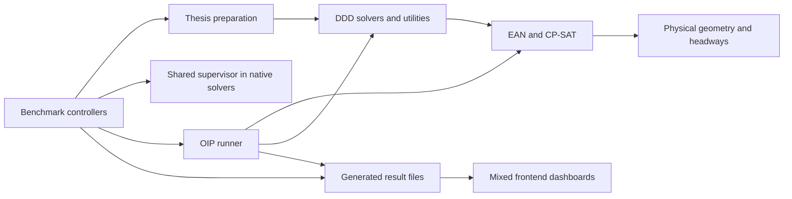
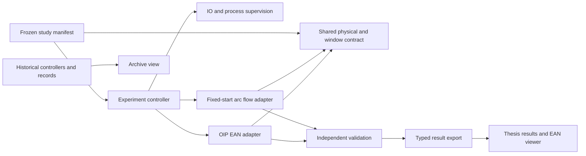

# Repository audit · 17 September 2026

### A) Executive summary

Basis: code snapshot `ae62642`, read-only inspection before the implementation below. The active Python tree contains 355 source modules (122,313 lines), 135 benchmark scripts (28,186 lines), and 170 test modules (41,102 lines); the frontend has 93 source files. Counts exclude ignored outputs. All these Python files parsed successfully. This is a structural audit and targeted contract review, **not a proof that every optimizer is correct**.

Scope clarification: repository/archive/frontend restructuring is **planning only**.
The separately authorized run-contract changes and their 66 targeted regression
tests are recorded in [the implementation plan](../plans/thesis_reruns_and_repository_restructuring_20260917.md).
References below describe the audited snapshot; no historical result was changed.

The main risk is inconsistent experiment contracts and result provenance, rather than literal copy-paste. Journey preparation has no explicit 300-second continuation, while OIP does. The latest OIP suite imports old long-window reservoir loads into a two-cycle demand window. Old reference paths are hardcoded in the Journey campaign. These must not become the new thesis comparison by renaming runs.

Two confirmed defects need immediate fixes: zero unserved is lost in the OIP export; OIP resume checks configuration but not the frozen physical domain. Resume also resets the total campaign budget. The current Thesis page describes the superseded reservoir/evolution programme as the current study.

Recommended first PR: shared short-window contract, new reference identities, correct null/zero reporting, and immutable resume identity. Then separate current study navigation from historical results. Archive historical controllers before moving shared solver modules.

Limitations: none of `audit/{ruff.json,pyright.json,vulture.txt,deptry.txt,radon-complexity.txt,radon-maintainability.txt,coverage.txt,import-graph.svg}` exists. No measured coverage or dead-symbol proof is claimed. Direct AST analysis found only two exact function-body duplicates of at least 16 lines, including one test helper. Near-duplication below is based on source review. Generated result trees, frozen historical source copies, binary snapshots, thesis/presentation documents, dependencies and Git history are excluded from code counts and refactoring. Thesis chapter 3.2 was read only to check the physical contract. No optimization campaign was started.

### B) Dead code table

| Priority | Candidate | Evidence | Usage verification | Classification | Recommended action |
|---|---|---|---|---|---|
| P2 | `benchmarks/finish_thesis_current_run.py:1` | One-off handoff with hardcoded pause reason and pending series | No source/test/doc/config references found by filename search; still a CLI | Needs manual verification | Preserve in `archive/benchmarks`; label historical, do not execute as the current controller. |
| P2 | `benchmarks/run_thesis_revised_journey_campaign.py:103` | Hardcoded dated K31 results and old fleet grid | Referenced by `docs/plans/thesis_study_execution_20260915.md:212` | Needs manual verification | Archive original; replacement must recalibrate under the new contract. Update documentation link. |
| P2 | `benchmarks/run_cp_formulation_campaign.py:21` | Host-specific CPLEX executable and historical ablation | `tests/test_cp_formulation_campaign.py:7`, historical plan refer to it | Do not remove yet | Archive only with its fixture/path updates; keep result reproduction instructions. |
| P2 | `optimization/ddd/trajectory_exact_pricing.py`, `trajectory_root_column_generation.py` | Largest source modules (4,471 and 4,220 lines); historical research route | Exported by `optimization/ddd/__init__.py:573,663`; benchmark and test callers | Do not remove yet | Trace transitive imports before any archive move. Size is not evidence of dead code. |
| P2 | `optimization/ddd/reservoir_*`, `optimization/ean`, `optimization/ddd/resource_time.py` | Many alternative methods; also shared certificates, resources and validators | OIP, current benchmark preparation, exports and tests import them | Do not remove yet | Keep shared physical/validation code active; archive standalone experiment entry points first. |
| P3 | `frontend/src/pages/EvolutionLivePage.tsx` and historical dashboard pages | No longer the primary experiment interface | Active routes in `App.tsx:7–26`, existing result links | Do not remove yet | Move to archive navigation, lazy-load, preserve direct URLs. |
| P3 | `benchmarks/snapshots/*` | Already tracked historical binary bundles | Historical findings/checksum files reference them | Needs manual verification | Keep existing evidence; moving binaries does not shrink Git history. Do not add new run bundles to source commits. |

No source module is classified **Safe to remove** on this evidence. Archival is preservation, not proof of non-use.

### C) Duplicate logic table

| Priority | Locations | Duplication pattern | Differences or risks | Recommended action |
|---|---|---|---|---|
| P1 | `benchmarking/thesis_cases.py:449`, `benchmarking/oip_pattern_waiting.py:66` | Derive two-cycle demand and completion independently | OIP adds 300 seconds continuation; Journey inherits its example tail | One window value object; adapters keep different start policies and clocks explicit. |
| P1 | `run_oip_pattern_screening.py:274`, `run_oip_thesis_pattern_campaigns.py:23`, `run_thesis_revised_journey_campaign.py:103` | Freeze fleet, loads and reference assumptions in different controllers | Imported reservoir load versus short-window calibration; weak resume checks | Shared contract metadata and reference validation, explicit calibrated input rather than date/path conventions. |
| P2 | `run_oip_pattern_screening.py:541`, other benchmark publishers | Read/modify/write frontend index independently | Atomic JSON file replacement does not make concurrent index updates transactional | Single result-index publisher; serialize publication or use lock. Current sequential execution reduces, but does not remove, this risk. |
| P2 | `ddd/trajectory_oip.py:693`, `ddd/trajectory_reservoir.py:835` | Identical `_resource_occurrences_match` body | Different surrounding movement lifecycle | Extract only this pure certificate-comparison helper with regression tests. |
| P3 | `tests/test_optimization_ean_movement_plan_validation.py:512`, `tests/test_optimization_ean_projection.py:210` | Identical `_replace_visit` test helper | Independent test setup; low cost | Optional fixture extraction, lower priority than contract bugs. |

### D) Coupling / architecture issues

1. **P1 — experiment identity.** `run_oip_pattern_screening.py:55` compares only `configuration_fingerprint`; `:59` grants a fresh deadline. `freeze_campaign` already has per-K domain fingerprints, but does not check them at resume. Store and verify domain, demand, masks and source identity; preserve the original execution deadline. A prepared-only manifest should start its clock at first execution.
2. **P1 — reporting correctness.** `optimization/oip/runner.py:576` uses `unserved_passengers or demand_total`; a legitimate zero becomes all passengers unserved. The same block supplies objective zero for absent incumbents. Use optional values directly; unknown is not zero. Build-only and feasibility runs must have no optimization incumbent/gap.
3. **P1 — comparable domains.** `thesis_cases.prepare_fixed_k_experiment` builds fixed balanced starts; `oip_pattern_waiting` builds optimized placements. Keep this intended difference labelled. Share headway geometry and demand/service/operation windows; do not claim identical optimization domains. DDD's generic resource-time layer receives resources through `ddd/artifact_adapter.py:213–254`; entry checks need cross-adapter regression tests, not another copied resource implementation.
4. **P1 — calibration provenance.** `run_oip_thesis_pattern_campaigns.py:23–27` explicitly imports older reservoir loads. They are legal technical stress loads but not newly calibrated OIP thesis capacities. Remove them as automatic thesis defaults. Journey's hardcoded old K31 imports must also be replaced by fresh short-contract references.
5. **P2 — orchestration inside optimizer export.** `optimization/oip/runner.py:540–775` builds frontend-specific detail/index structures; benchmark controllers also publish these files. Desired boundary: solver result → validated result record → frontend publisher. First step is a tested export adapter, preserving existing JSON readers.
6. **P2 — shared utilities live under a historical solver.** Most benchmark controllers import `ddd.cp_sat_certificate.atomic_json`; the generic supervisor module also imports native solver/preparation dependencies at top level. Extract IO, source hashing and process supervision independently of any solver before archiving DDD modules.
7. **P2 — UI describes an obsolete programme.** `ThesisPage.tsx:71–77` hardcodes reservoir capacity and evolutionary lines. `OptimizationPage.tsx:66` mixes every historical campaign; `App.tsx` eagerly imports legacy views. Use explicit current-study membership, archive navigation and lazy historical pages. No filename-based inference that a run is a current thesis result.
8. **P2 — incomplete frozen identity.** `ExperimentCaseSpec.fingerprint` hashes logical inputs, not resolved geometry/headways. Keep resolved physical fingerprints and code digest alongside the case key. A scenario label alone is insufficient to reuse a capacity proof.

Risk-oriented test gaps: entry/exit propagation into both EAN and DDD; explicit service cutoff before continued movement; resume after code/domain change; absent incumbent versus zero unserved; new-reference blocking; new fleet matrix. Existing tests cover many solver internals but do not establish these cross-layer contracts. No coverage percentage is inferred.

### E) Dependency issues

- **P1:** `psutil` is only in the `native-solvers` extra (`pyproject.toml:19`), but the shared supervisor imports it (`benchmarking/native_solvers.py:247`); ordinary thesis controllers use it too. Make it a common orchestration dependency or consistently require a dedicated campaign extra. Do not silently disable memory enforcement.
- **P2:** `benchmarks/analyze_reservoir_greedy_objectives.py:8–11` and other analysis scripts import matplotlib, absent from the project dependencies. Put plotting in an explicit analysis extra if retained; do not force it on core solver users.
- SciPy, tqdm and NumPy have real imports; no evidence to remove them. Gurobi and OR-Tools are both used by the selected workflow. Frontend `culori`, `fflate`, `mediabunny` are used by colors/replay export; no unused-dependency claim.
- Experimental solver extras (DIDP, IBM, Hexaly, evolutionary, native) should remain optional while their reproductions are retained. Lazy-facade tests already protect solver-free imports. The IBM historical campaign embeds a local executable path; preserve as historical configuration rather than a portable default.

### F) Suggested PR sequence

1. **Snapshot and freeze audit** — code-only commit, this report and implementation plan; no experiments. Risk low.
2. **Shared thesis contract and result correctness** — `thesis_cases`, `oip_pattern_waiting`, fixed-K config, OIP export and screening resume. Test window/headway equality, zero/unknown metrics and incompatible resume. Risk medium, because changed physical contracts require new references.
3. **Fresh five-step Journey preparation** — archive old controller, generate new calibration + dependent run manifest; preserve 25/75% relative loads and half K31 constant load. Test job counts, deterministic IDs, source identity and rejection of old reference results. No automatic solver start. Risk medium.
4. **New OIP calibration gate** — replace imported long-window demand defaults with explicit evidence from the short OIP contract. Keep feasible lower bounds distinct from proven capacities; agree on density scaling before launching. Test manifest validation. Risk medium.
5. **Frontend split** — current thesis study, scenario viewer, current EAN run details, archive; preserve links and result files. Test classification, unknown values and build; manually inspect empty/current/archive views. Risk low–medium.
6. **Archive by dependency closure** — one-off controllers first; then obsolete campaign modules with related tests/docs. Move common IO/supervision out before solver directories. Verify imports, CLI help and a small current end-to-end case after each batch. Do not delete scientific evidence. Risk medium–high if batched broadly.

### G) Mermaid diagram of current architecture

### H) Mermaid diagram of proposed architecture

