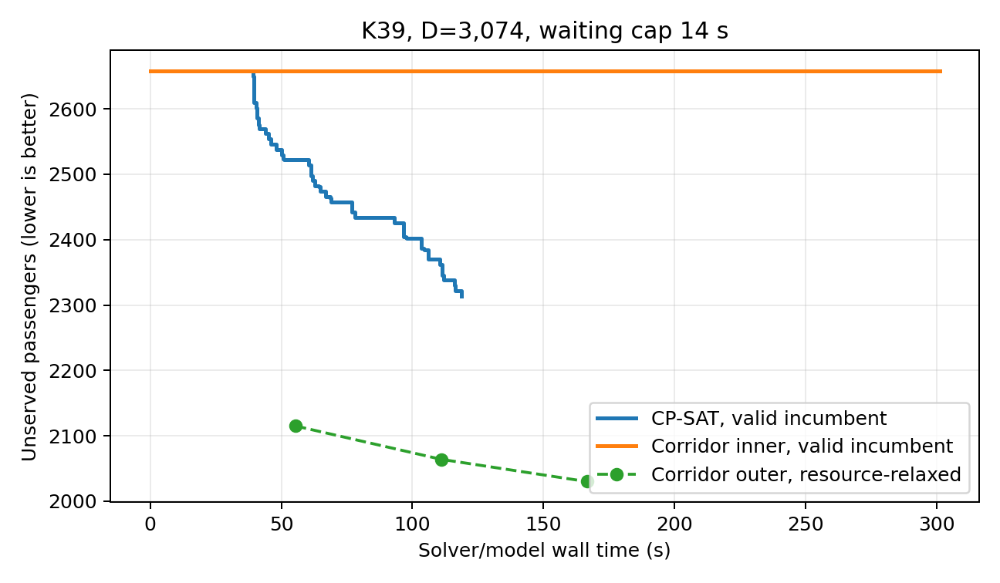

# Befund: kompaktes Waiting-Corridor-Arc-Flow

Stand: 14. September 2026.

## Implementierter Modellvertrag

Der neue Pfad unter
`optimization/ddd/corridor_arc_flow` modelliert Fixed-K mit festen
Startpositionen, freie STOP-/SKIP-Wahlen, ganzzahlige Mikrosekundenzeiten,
Exit-Waiting und direkte ganzzahlige Beförderungen. Die Waitinggrenze ist

\[
W_K=\lceil 2C_{AS}/K\rceil\text{ Sekunden}.
\]

Waitingwerte werden nicht aufgezählt. Eine Partition beschreibt
zusammenhängende Integerbereiche; ausgewählte Routen aktivieren exakte
Zeitgleichungen. `inner` verwendet vollständige konservative
Ressourcenhüllen. `outer` verwendet nur den in allen Realisierungen
enthaltenen Ressourcenkern. Outer-Kandidaten werden separat gespeichert und
niemals als gültige Fahrpläne ausgegeben. Bewegung und Ride-Mengen durchlaufen
die bestehenden solverunabhängigen Fixed-K-Prüfer.

Die adaptive Suche rekonstruiert tatsächliche Ressourcenkollisionen des
Outer-Kandidaten. Je Runde werden höchstens 16 beteiligte Beginn- oder
Waitingwerte als exakte Ein-Tick-Zellen verankert. Neue Modelle erhalten den
besten gültigen Plan und dessen auf der aktuellen Nachfrage erneut optimierte
Passagierzuordnung als MIP-Start.

## Korrektheit

Sieben neue Modultests sowie 61 angrenzende Waiting-, Ressourcen-,
Zeitverfeinerungs- und CP-SAT-Tests bestehen. Die Tests decken insbesondere
Mikrosekundenbereiche ohne Enumeration, Hülle und Kern, verlustfreie
Verfeinerung, Ein-Tick-Anker, unabhängige Zertifikate sowie

\[
LB_{outer}\le U_{inner}
\]

auf kleinen Fällen ab. Ein K2-Fall ist im groben Inner-Modell unzulässig und
wird nach konfliktgesteuerter Verfeinerung mit U=6 optimal lösbar.

Während der Implementierung wurde ein numerischer Formulierungsfehler
gefunden. Routendauern von etwa \(5.4\cdot10^7\) Ticks als Koeffizienten vor
Binärvariablen führten bei Gurobi zu einem falschen Root-Cutoff. Ein MIP-Start
mit U=6 wurde akzeptiert, während derselbe Solve ohne Start U=8 als optimal
meldete. Routebedingte Gleichungen mit Einheitskoeffizienten beheben den Fehler;
der Gegenfall ist nun ein Regressionstest.

## Gate-Ergebnisse

| Fall | Methode | Zeit | gültige UB | globale LB | Beobachtung |
|---|---|---:|---:|---:|---|
| K20, D=3.074, W=28 s | Corridor adaptive | 50 s Budget | 1.172 | 593 | Inner am Root optimal; Outer U=1.161 kollidiert |
| K39, D=3.074, W=14 s | Corridor adaptive | 300 s Budget | 2.658 | 0 | sieben Runden; keine gültige Verbesserung |
| K39, D=3.074, W=14 s, Seed 1 | Corridor adaptive | 300 s Budget | 2.658 | 0 | sieben Runden; keine gültige Verbesserung |
| K39, gleiche Domäne | vollständiges CP-SAT | 120 s Suche | 2.314 | 0 | stetige Verbesserungen bis Sekunde 118 |
| K38 All-Stop, D=3.074, No-Wait | geprüfter Referenzfahrplan | fixe Bewegung | 315 | — | 2.759 bedient; Passagierzuordnung für diesen Fahrplan optimal |

K39 verwendet einen unabhängig validierten historischen No-Wait-Plan. Seine
Passagiere wurden auf D=3.074 neu optimiert; er bedient 416 Personen und hat
damit U=2.658. Der frühere K39-Plan mit U=1.426 ist kein zulässiger Seed für
diesen Versuch, weil er bis zu 25,36542 s wartet und damit die neue Grenze von
14 s überschreitet.

Das K39-Corridor-Modell begann mit 9.561 Korridorarcs. Über sieben Runden wuchs
es auf 10.113 Arcs; Inner hatte ungefähr 29.600 bis 30.200 Variablen und
133.000 bis 137.000 Nebenbedingungen. Der Aufbau benötigte rund fünf Sekunden je Runde.
Outer verbesserte seine abstrakte Zielfunktion von U=2.115 über U=2.064 auf
U=2.030. Diese Kandidaten hatten 212 bis 245 an exakten
Ressourcenkollisionen beteiligte Arcs. Nach 112 lokalen Verankerungen blieb
Inner bei U=2.658. Beide globalen Bounds blieben null.

CP-SAT war größer (49.760 Variablen und 105.467 Constraints), verbesserte aber
die gültige UB in 120 Sekunden in vielen Schritten von 2.658 auf 2.314. Der
letzte Fortschritt trat nach 118,59 Sekunden ein; ein Plateau war in diesem
Zeitfenster nicht erreicht.

Die Wiederholung mit Gurobi-Seed 1 bestätigt den negativen Befund. In allen
sieben Inner-Runden blieb U=2.658; auch die Outer-Suche blieb diesmal bei
U=2.658. Der Lauf benötigte 295,5 Sekunden, erreichte weiterhin nur die globale
Untergrenze null und nutzte in der Spitze 6,69 GB Prozessbaum-RSS. Mehr Speicher
ist daher keine erkennbare Lösung des Engpasses.

Der Corridor-Pilot schlägt die bekannte All-Stop-Referenz nicht. Schon der
geprüfte No-Wait-All-Stop-Fahrplan mit 38 statt 39 Kabinen bedient unter derselben
historischen Fünf-Stationen-Physik und derselben Batch-Nachfrage 2.759 Personen
(U=315). Dafür wurde die ganzzahlige Passagierzuordnung bei fixierter Bewegung
optimal gelöst. Der beste Corridor-Plan bedient nur 416 Personen; CP-SAT bedient
im kurzen Vergleich 760. Diese Aussage benötigt keinen globalen
All-Stop-Optimalitätsbeweis, weil bereits ein einzelner gültiger All-Stop-Plan
beide Skip-Stop-Ergebnisse klar dominiert.

## Entscheidung

Der Pilot besteht die Korrektheitsgates, verfehlt aber das festgelegte
K39-Fortsetzungskriterium in beiden Gurobi-Seeds. Er bedient nicht zehn Personen
mehr als CP-SAT, schlägt die bekannte All-Stop-Referenz nicht und schließt den
globalen Gap nicht.

Der Engpass ist nicht die Anzahl der Waitingticks oder die rohe Modellgröße.
Die Outer-Relaxation kann transportstarke Muster sehen, verteilt deren
Ressourcenkollisionen aber über mehr als zweihundert Arcs. Eine lokale
Verfeinerung von 16 Zellen pro Runde überträgt diese Muster nicht schnell genug
in die konservative Inner-Domäne. Der entscheidende Verlust entsteht durch die
robusten Hüllencliquen: Zwei breite Korridore dürfen nur gemeinsam gewählt werden,
wenn ihre Hüllen für alle enthaltenen Zeiten getrennt sind. Für einen Fahrplan
würde die Existenz eines konfliktfreien Zeitpaares genügen. Die Outer-Kerne
sind im Gegenzug so schwach, dass die globale Schranke null bleibt.

Für die Thesis ist dies ein negativer, aber klarer Formulierungsbefund. Das
Linienplanmodell und CP-SAT bleiben die praktischen Verfahren; der
Corridor-Pilot sollte nicht zum Standard werden. Ein weiterer Versuch wäre nur
als neue Ressourcenformulierung sinnvoll: Für ausgewählte überlappende
Korridore die exakte zeitabhängige Reihenfolgedisjunktion separieren, statt das
Paar aufgrund seiner gesamten Hüllen zu verbieten. Längere Läufe oder mehr
Verfeinerung derselben Hüllen-/Kernarchitektur sind durch die Messungen nicht
begründet.

Die vollständigen Rohdaten liegen unter
`benchmarks/output/ddd_corridor_waiting_pilot_20260914/`. Grundlagen der
Formulierung sind Marshall et al., *Interval-based Dynamic Discretization
Discovery for Solving the Continuous-Time Service Network Design Problem*,
<https://doi.org/10.1287/trsc.2020.0994>, und Van Dyk und Koenemann, *Sparse
dynamic discretization discovery via arc-dependent time discretizations*,
<https://doi.org/10.1016/j.cor.2024.106715>.
